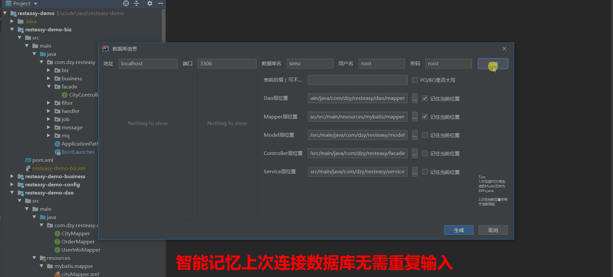
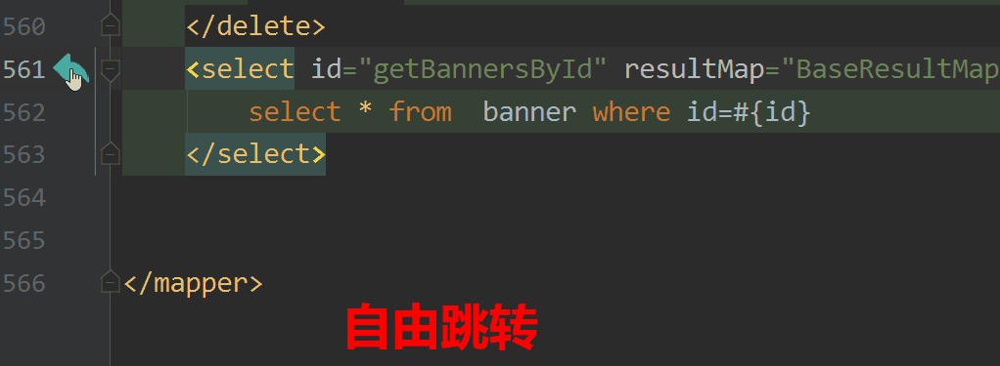
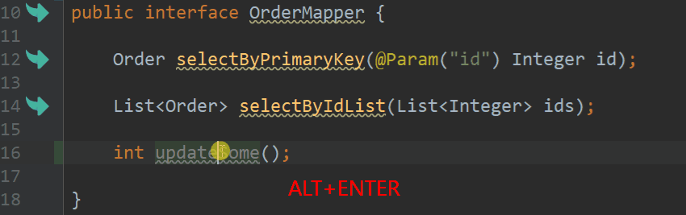
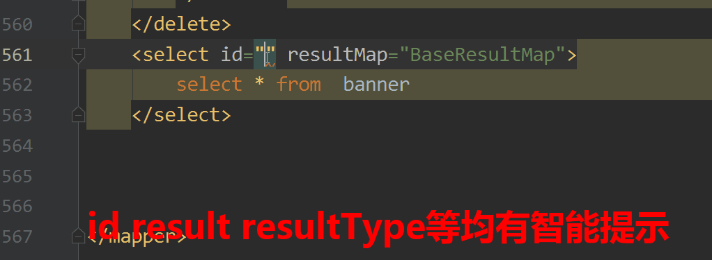
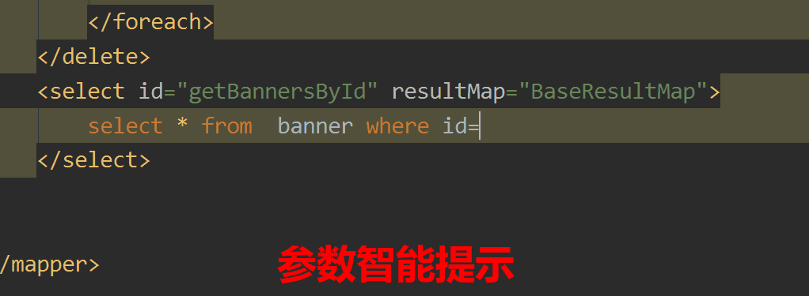
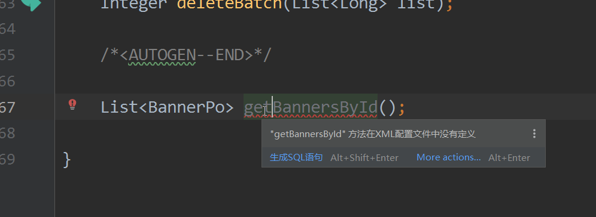
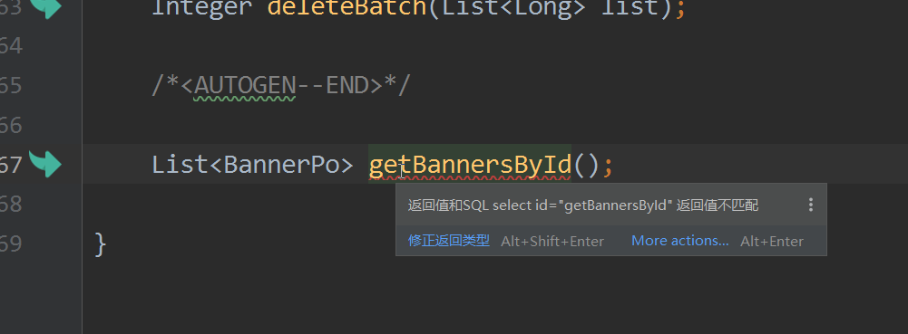

# Mybatis Lite

 

## 案例演示

### I. 生成代码
> Mybatis Lite根据预先设置模板生成controller/Service/dao/sql等层次代码，一次性生成常用增删改查代码，模板可编辑，减少重复工作，也可单个生成部分代码
- 智能记忆上次输入数据库
- 系统自动定位类存储位置，无需手动选择
- 可选保存当前位置，作用于当前项目，避免系统选择错误
- 双击模板一列即可实时编辑模板，语法高亮显示
- 可选PO大小写功能，默认小写Po
> Tools->MyBatis-Lite->Generate-Code

### II. 跳转配置
> Mybatis Lite提供Dao层到Xml-sql层的跳转,根据官方建议优化跳转性能，修复编辑XML过程中标签消失bug，此功能默认打开(可能会与Mybatis Plugin / free mybatis plugin等插件冲突显示2个标签)，需要关闭的同学，请在IDEA->File菜单->Setting菜单->Mybatis Lite菜单->导航开关(不同版本IDEA可能路径有点不同但是都在setting里面) 关闭
- 优化lineMarker性能，资源损耗更小
- 编辑过程中不会有标签突然出现或者消失bug

### III. 生成xml-sql
> 用户在dao层编写方法的时候，可按`alt+enter`快捷键，系统会自动根据方法前缀生成相应的增删改查sql,系统自动识别当前XML用的表名，并编写部分预设sql,如果要新增匹配前缀可到setting里面设置
- 自动识别前缀选择增删改查语句无需选择
- 生成的sql语句自动追加在XML末尾，便于查找
- 自动编写部分sql语句，包括表名

### IV. 智能提示
> 在编写XML-Sql过程中，智能提示可辅助用户编写更快速

例2：表字段提示

> 值得注意的是这个功能依赖于用户在项目中的数据库配置文件，系统自动查找并连接，如果系统获取不到建议在Setting->Mybatis-Lite设置中指定配置文件名,如果DB配置高度定制化，这样系统是无法获取到数据库信息的，建议到Tools->Mybatis Lite->DB config填写下数据库信息,这样智能提示即可生效,如果还是有问题，建议暂时关闭此功能(Setting中)，并在issue中描述一下，以便作者兼容，谢谢

例2：标签内容智能提示

例3：参数智能提示

### V. 错误提示
> 如果误删除XML等或者返回类型编写错误时候系统会有提示

例1: Dao中方法未定义

例2: 返回值不匹配

### VI. 打印SQL
> File->Setting->Mybatis Lite -> 其它配置-> 启用SQL打印选择开即可，然后运行项目即可打印SQL,暂时只针对使用druid数据源的项目生效，如果有使用到其它数据源请在issue中提出，后期会陆续适配

## 下载安装  
- IDEA-> File -> Settings -> Plugins -> MarketPlace,输入mybatis lite，点install安装即可
- 点击 [这里](https://plugins.jetbrains.com/plugin/10921-mybatis-lite) 下载最新版进行离线安装，IDEA-> File -> Settings -> Plugins ->setting(齿轮图标)-> Install plugin from disk
